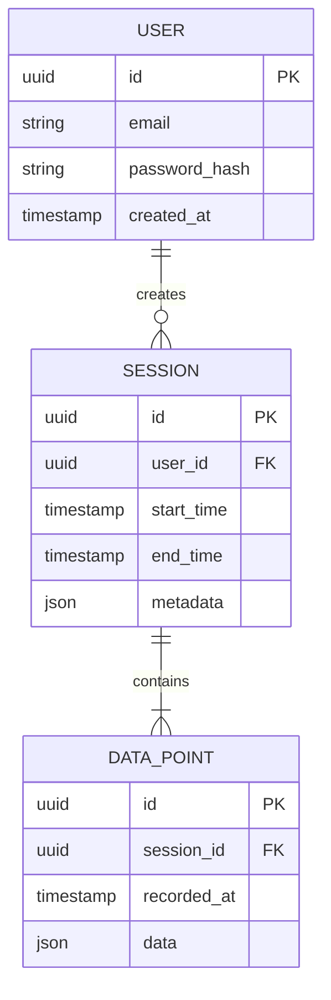

# Architecture Decision Record: {PROJECT_NAME}

**Version:** 1.0
**Date:** {DATE}
**Status:** Draft | In Review | Approved

---

## Overview
{Brief description of the system being built and its primary purpose}

## Architecture Goals
1. {Goal 1 - e.g., Scalability}
2. {Goal 2 - e.g., Maintainability}
3. {Goal 3 - e.g., Performance}

---

## Technology Stack

### Frontend
| Layer | Technology | Rationale |
|-------|------------|-----------|
| Framework | {React/Vue/etc.} | {Why chosen} |
| Styling | {Tailwind/CSS-in-JS/etc.} | {Why chosen} |
| State Management | {Redux/Zustand/Context} | {Why chosen} |
| Build Tool | {Vite/Webpack/etc.} | {Why chosen} |

### Backend
| Layer | Technology | Rationale |
|-------|------------|-----------|
| Runtime | {Node.js/Python/Go} | {Why chosen} |
| Framework | {Express/FastAPI/etc.} | {Why chosen} |
| API Style | {REST/GraphQL} | {Why chosen} |

### Data Layer
| Component | Technology | Rationale |
|-----------|------------|-----------|
| Primary Database | {PostgreSQL/MongoDB} | {Why chosen} |
| Cache | {Redis/None} | {Why chosen} |
| File Storage | {S3/Local/etc.} | {Why chosen} |

### Infrastructure
| Component | Technology | Rationale |
|-----------|------------|-----------|
| Hosting | {Vercel/AWS/etc.} | {Why chosen} |
| CI/CD | {GitHub Actions/etc.} | {Why chosen} |
| Monitoring | {Datadog/etc.} | {Why chosen} |

---

## System Architecture

### High-Level Diagram
```
┌─────────────────────────────────────────────────────────────┐
│                        CLIENT                               │
│  ┌─────────┐  ┌─────────┐  ┌─────────┐                     │
│  │   Web   │  │ Mobile  │  │ Desktop │                     │
│  └────┬────┘  └────┬────┘  └────┬────┘                     │
└───────┼────────────┼────────────┼───────────────────────────┘
        │            │            │
        └────────────┼────────────┘
                     │ HTTPS
        ┌────────────┴────────────┐
        │       API GATEWAY       │
        │    (Authentication)     │
        └────────────┬────────────┘
                     │
        ┌────────────┴────────────┐
        │      APPLICATION        │
        │        SERVER           │
        └────────────┬────────────┘
                     │
        ┌────────────┴────────────┐
        │       DATA LAYER        │
        │  ┌─────┐    ┌─────┐    │
        │  │ DB  │    │Cache│    │
        │  └─────┘    └─────┘    │
        └─────────────────────────┘
```

### Component Responsibilities
| Component | Responsibility |
|-----------|---------------|
| Client | {User interface, input validation} |
| API Gateway | {Routing, auth, rate limiting} |
| Application | {Business logic, data processing} |
| Database | {Persistent storage, queries} |
| Cache | {Session data, frequent reads} |

---

## Data Model

### Entity Relationship Diagram


### Key Entities
| Entity | Purpose | Key Fields |
|--------|---------|------------|
| {Entity 1} | {Purpose} | {Important fields} |
| {Entity 2} | {Purpose} | {Important fields} |

---

## API Design

### Endpoints Overview
| Method | Endpoint | Purpose |
|--------|----------|---------|
| GET | /api/v1/resources | List resources |
| GET | /api/v1/resources/:id | Get single resource |
| POST | /api/v1/resources | Create resource |
| PUT | /api/v1/resources/:id | Update resource |
| DELETE | /api/v1/resources/:id | Delete resource |

### Authentication
- **Method:** {JWT/Session/OAuth}
- **Token Location:** {Header/Cookie}
- **Refresh Strategy:** {Description}

### Error Response Format
```json
{
  "error": {
    "code": "ERROR_CODE",
    "message": "Human readable message",
    "details": {}
  }
}
```

---

## Security Considerations

### Authentication & Authorization
- [ ] {Auth mechanism description}
- [ ] {Role-based access control}

### Data Protection
- [ ] Encryption at rest: {Yes/No - method}
- [ ] Encryption in transit: {TLS version}
- [ ] PII handling: {Approach}

### API Security
- [ ] Rate limiting: {Limits}
- [ ] Input validation: {Approach}
- [ ] CORS policy: {Configuration}

---

## Scalability Considerations

### Current Design Limits
| Component | Limit | Scaling Strategy |
|-----------|-------|-----------------|
| Database | {Concurrent connections} | {Horizontal/Vertical} |
| API | {Requests/second} | {Load balancing} |

### Future Scaling Path
{Description of how the architecture can scale}

---

## Deployment Architecture

### Environments
| Environment | Purpose | URL |
|-------------|---------|-----|
| Development | Local development | localhost:3000 |
| Staging | Pre-production testing | staging.{domain} |
| Production | Live application | {domain} |

### Deployment Pipeline
```
Code Push → Lint/Test → Build → Deploy Staging → Manual QA → Deploy Production
```

---

## Decisions Log

### ADR-001: {Decision Title}
**Status:** Accepted
**Context:** {Why this decision was needed}
**Decision:** {What was decided}
**Consequences:** {Positive and negative outcomes}

### ADR-002: {Decision Title}
{Same format...}

---

## Appendix

### Alternative Options Considered
| Option | Pros | Cons | Why Not Chosen |
|--------|------|------|----------------|
| {Option 1} | {Pros} | {Cons} | {Reason} |

### References
- {Link to tech documentation}
- {Link to similar implementations}

---

## Approval

| Role | Name | Date | Signature |
|------|------|------|-----------|
| Technical Lead | | | ☐ Approved |
| Senior Developer | | | ☐ Approved |
