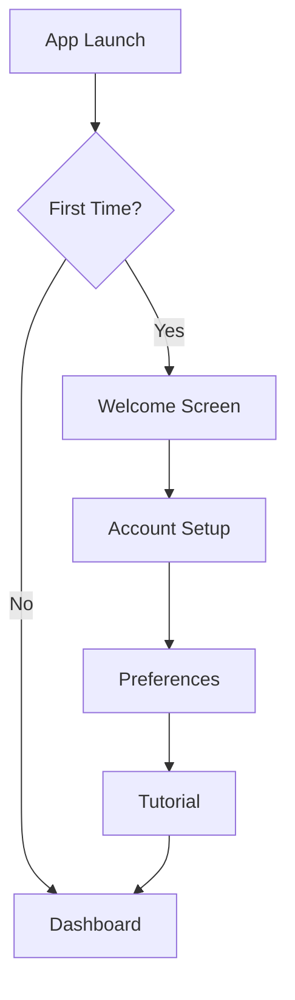

# Design Specification: {PROJECT_NAME}

**Version:** 1.0
**Date:** {DATE}
**Status:** Draft | In Review | Approved

---

## Design Overview
{Brief description of the design approach and key UX goals}

## Design Principles
1. {Principle 1 - e.g., "Simplicity over features"}
2. {Principle 2 - e.g., "Feedback at every step"}
3. {Principle 3 - e.g., "Mobile-first design"}

---

## User Flows

### Flow 1: {Flow Name - e.g., "New User Onboarding"}


**Flow Description:**
{Narrative description of the flow}

**Entry Points:** {How users reach this flow}
**Exit Points:** {Where users can go from here}
**Edge Cases:** {Error states, alternative paths}

### Flow 2: {Flow Name}
{Same format...}

---

## Screen Inventory

| # | Screen Name | Purpose | Entry Points |
|---|------------|---------|--------------|
| 1 | Splash | Branding, loading | App launch |
| 2 | Login | Authentication | Splash, logout |
| 3 | Dashboard | Overview, navigation | Login, all screens |
| 4 | {Screen} | {Purpose} | {Entry points} |

---

## Wireframes

### Screen: {Screen Name}

**Purpose:** {What this screen accomplishes}
**User Goals:** {What users want to do here}

```
┌─────────────────────────────────────┐
│  ← Back            Title        ⚙️  │
├─────────────────────────────────────┤
│                                     │
│        {Main Content Area}          │
│                                     │
│   ┌─────────────────────────────┐   │
│   │                             │   │
│   │      {Primary Element}      │   │
│   │                             │   │
│   └─────────────────────────────┘   │
│                                     │
│   {Secondary content}               │
│   {Supporting information}          │
│                                     │
├─────────────────────────────────────┤
│  [Action 1]    [Action 2]          │
└─────────────────────────────────────┘
```

**Key Elements:**
| Element | Type | Behavior |
|---------|------|----------|
| {Element 1} | {Button/Input/etc.} | {What happens on interaction} |
| {Element 2} | {Type} | {Behavior} |

**States:**
- **Loading:** {How it looks while loading}
- **Empty:** {When no data exists}
- **Error:** {When something fails}
- **Success:** {Confirmation state}

---

## Navigation Structure

### Information Architecture
```
App Root
├── Dashboard (default)
│   └── Quick Actions
├── {Section 1}
│   ├── {Sub-page 1}
│   └── {Sub-page 2}
├── {Section 2}
│   ├── {Sub-page 1}
│   └── {Sub-page 2}
├── Profile
│   ├── Account Settings
│   └── Preferences
└── Settings
```

### Navigation Patterns
| Navigation Type | Implementation |
|-----------------|----------------|
| Primary | {Tab bar / Side nav / etc.} |
| Secondary | {Headers / Breadcrumbs} |
| Contextual | {Action sheets / Modals} |

---

## Component Library

### Decision: {Library Choice}
**Options Considered:**
- Option A: {Library 1} - {Pros/Cons}
- Option B: {Library 2} - {Pros/Cons}

**Selected:** {Chosen library}
**Rationale:** {Why this choice}

### Core Components
| Component | Usage | Variants |
|-----------|-------|----------|
| Button | Actions, CTAs | Primary, Secondary, Ghost, Danger |
| Input | Form fields | Text, Number, Password, Search |
| Card | Content containers | Default, Elevated, Interactive |
| Modal | Dialogs, confirmations | Alert, Form, Full-screen |
| {Component} | {Usage} | {Variants} |

---

## Design Tokens

### Colors
| Token | Value | Usage |
|-------|-------|-------|
| --color-primary | {#hex} | Buttons, links, accents |
| --color-secondary | {#hex} | Secondary actions |
| --color-background | {#hex} | Page backgrounds |
| --color-surface | {#hex} | Cards, elevated surfaces |
| --color-text-primary | {#hex} | Main body text |
| --color-text-secondary | {#hex} | Supporting text |
| --color-error | {#hex} | Error states |
| --color-success | {#hex} | Success states |
| --color-warning | {#hex} | Warning states |

### Typography
| Token | Value | Usage |
|-------|-------|-------|
| --font-family-primary | {Font name} | Body text |
| --font-family-heading | {Font name} | Headings |
| --font-size-xs | 12px | Captions, labels |
| --font-size-sm | 14px | Secondary text |
| --font-size-base | 16px | Body text |
| --font-size-lg | 18px | Large body |
| --font-size-xl | 24px | Subheadings |
| --font-size-2xl | 32px | Page titles |

### Spacing
| Token | Value | Usage |
|-------|-------|-------|
| --space-xs | 4px | Tight spacing |
| --space-sm | 8px | Component internal |
| --space-md | 16px | Between elements |
| --space-lg | 24px | Section spacing |
| --space-xl | 32px | Major sections |

### Borders & Shadows
| Token | Value | Usage |
|-------|-------|-------|
| --radius-sm | 4px | Buttons, inputs |
| --radius-md | 8px | Cards |
| --radius-lg | 16px | Modals |
| --shadow-sm | {value} | Subtle elevation |
| --shadow-md | {value} | Cards |
| --shadow-lg | {value} | Modals, dropdowns |

---

## Responsive Design

### Breakpoints
| Name | Width | Target |
|------|-------|--------|
| Mobile | <640px | Phones |
| Tablet | 640-1024px | Tablets, small laptops |
| Desktop | >1024px | Desktop browsers |

### Responsive Behaviors
| Component | Mobile | Tablet | Desktop |
|-----------|--------|--------|---------|
| Navigation | Bottom tab bar | Side rail | Full sidebar |
| Grid | 1 column | 2 columns | 3-4 columns |
| {Component} | {Behavior} | {Behavior} | {Behavior} |

---

## Accessibility Requirements

### WCAG Compliance Target: {AA/AAA}

### Checklist
- [ ] Color contrast ratio ≥ 4.5:1 for text
- [ ] All interactive elements keyboard accessible
- [ ] Focus indicators visible
- [ ] Alt text for all images
- [ ] Form inputs have labels
- [ ] Error messages linked to inputs
- [ ] Touch targets ≥ 44x44px
- [ ] No information conveyed by color alone

---

## Animation & Motion

### Principles
- Purpose: {Only animate with purpose}
- Duration: {Transitions 150-300ms}
- Easing: {ease-out for enter, ease-in for exit}

### Standard Transitions
| Action | Duration | Easing |
|--------|----------|--------|
| Button hover | 150ms | ease-out |
| Page transition | 300ms | ease-in-out |
| Modal open | 200ms | ease-out |
| Modal close | 150ms | ease-in |

---

## Approval

| Role | Name | Date | Signature |
|------|------|------|-----------|
| Design Lead | | | ☐ Approved |
| Product Owner | | | ☐ Approved |
