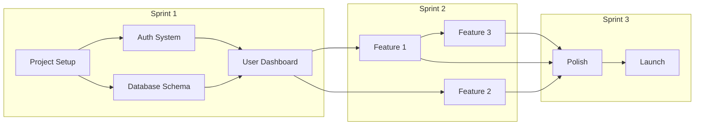

# Implementation Plan: {PROJECT_NAME}

**Version:** 1.0
**Date:** {DATE}
**Status:** Draft | In Review | Approved

---

## Overview
{Brief summary of what will be built and the implementation approach}

## Timeline Summary
| Phase | Duration | Key Deliverables |
|-------|----------|------------------|
| Sprint 1 | {dates} | Foundation, Auth |
| Sprint 2 | {dates} | Core Features |
| Sprint 3 | {dates} | Polish, Launch |

---

## Epic Breakdown

### Epic 1: {Epic Name}
**Goal:** {What this epic accomplishes}
**Dependencies:** {Other epics this depends on}
**Estimated Points:** {Total story points}

#### Stories

##### Story 1.1: {Story Title}
**Priority:** P0 (Critical) | P1 (High) | P2 (Medium) | P3 (Low)
**Points:** {Estimate}

**As a** {user type}
**I want to** {action}
**So that** {benefit}

**Acceptance Criteria:**
- [ ] {Criterion 1}
- [ ] {Criterion 2}
- [ ] {Criterion 3}

**Technical Tasks:**
| Task | Estimate | Owner |
|------|----------|-------|
| {Task 1} | {hours/points} | |
| {Task 2} | {hours/points} | |
| {Task 3} | {hours/points} | |

**Notes:**
{Any implementation hints, gotchas, or references}

---

##### Story 1.2: {Story Title}
{Same format...}

---

### Epic 2: {Epic Name}
{Same format...}

---

## Sprint Plans

### Sprint 1: Foundation
**Goal:** {Sprint goal}
**Dates:** {Start} - {End}
**Capacity:** {Available points}

| Story | Points | Status |
|-------|--------|--------|
| {Story 1.1} | {pts} | Not Started |
| {Story 1.2} | {pts} | Not Started |
| **Total** | **{sum}** | |

**Sprint Risks:**
- {Risk 1 and mitigation}

**Definition of Done:**
- [ ] All acceptance criteria met
- [ ] Code reviewed
- [ ] Tests passing
- [ ] Documentation updated

---

### Sprint 2: Core Features
{Same format...}

---

### Sprint 3: Polish & Launch
{Same format...}

---

## Dependency Graph

---

## Risk Assessment

| Risk | Likelihood | Impact | Mitigation |
|------|------------|--------|------------|
| {Risk 1} | High/Med/Low | High/Med/Low | {Strategy} |
| {Risk 2} | High/Med/Low | High/Med/Low | {Strategy} |
| {Risk 3} | High/Med/Low | High/Med/Low | {Strategy} |

### Contingency Plans
**If {Risk 1} occurs:**
{Contingency plan}

**If {Risk 2} occurs:**
{Contingency plan}

---

## Technical Spikes

### Spike 1: {Spike Title}
**Question:** {What needs to be investigated}
**Time-box:** {Hours/days}
**Expected Output:** {Decision document, POC, etc.}

---

## Definition of Done

### Story Level
- [ ] Code complete and compiles
- [ ] Unit tests written and passing
- [ ] Code reviewed by peer
- [ ] Acceptance criteria verified
- [ ] No critical bugs

### Sprint Level
- [ ] All committed stories complete
- [ ] Integration tests passing
- [ ] Sprint demo completed
- [ ] Retrospective held

### Release Level
- [ ] All features working
- [ ] Performance benchmarks met
- [ ] Security review passed
- [ ] Documentation complete
- [ ] Deployment successful

---

## Resource Allocation

### Team
| Role | Person | Availability |
|------|--------|--------------|
| Tech Lead | {Name} |  |
| Backend Dev | {Name} |  |

### External Dependencies
| Dependency | Contact | Status |
|------------|---------|--------|
| {API access} | {Contact} | Pending/Confirmed |
| {Design assets} | {Contact} | Pending/Confirmed |

---

## Communication Plan

### Standups
- **Frequency:** Daily
- **Time:** {Time}
- **Format:** {Async/Sync}

### Sprint Ceremonies
| Ceremony | Frequency | Duration |
|----------|-----------|----------|
| Planning | Start of sprint | 2 hours |
| Review | End of sprint | 1 hour |
| Retro | End of sprint | 1 hour |

### Stakeholder Updates
- **Frequency:** {Weekly/Bi-weekly}
- **Format:** {Email/Meeting}

---

## Approval

| Role | Name | Date | Signature |
|------|------|------|-----------|
| Tech Lead | | | ☐ Approved |
| Product Owner | | | ☐ Approved |
| Stakeholder | | | ☐ Approved |
