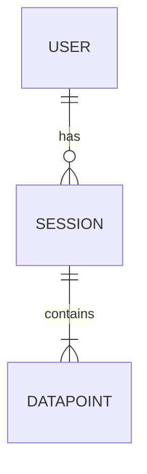

# Phase 2: Architecture

## Objective
Define the technical foundation with reasoned technology choices.

## Entry Criteria
- Approved PRD from Phase 1
- Clear understanding of features and constraints

## Key Activities

### 1. Technology Stack Selection
Present options with tradeoffs for each layer:

**Frontend Options:**
| Option | Best For | Tradeoffs |
|--------|----------|-----------|
| React | Complex SPAs, large ecosystem | Learning curve, boilerplate |
| Vue | Gentle learning curve, flexibility | Smaller ecosystem |
| Svelte | Performance, simplicity | Newer, fewer libraries |
| React Native | Cross-platform mobile | Platform-specific issues |
| Flutter | Beautiful UI, single codebase | Dart language, large bundle |

**Backend Options:**
| Option | Best For | Tradeoffs |
|--------|----------|-----------|
| Node.js/Express | JS fullstack, real-time | Callback patterns |
| Python/FastAPI | Data-heavy, ML integration | Async complexity |
| Go | High performance, concurrency | Smaller ecosystem |
| Serverless (Lambda) | Variable load, cost optimization | Cold starts, vendor lock |
| Supabase/Firebase | Rapid MVP, real-time | Limited customization |

**Database Options:**
| Option | Best For | Tradeoffs |
|--------|----------|-----------|
| PostgreSQL | Complex queries, reliability | Scaling complexity |
| MongoDB | Flexible schema, rapid iteration | Query limitations |
| SQLite | Local-first, embedded | Single writer |
| Redis | Caching, real-time | Memory constraints |
| TimescaleDB | Time-series data | PostgreSQL overhead |

### 2. Architecture Pattern
Choose based on requirements:
- **Monolith**: Simpler deployment, good for MVP
- **Microservices**: Scale independently, complex ops
- **Serverless**: Pay-per-use, event-driven
- **Local-first**: Offline support, sync complexity

### 3. Data Model Design
Create entity-relationship diagram:


Define:
- Core entities and relationships
- Key attributes for each entity
- API endpoints (REST or GraphQL)

### 4. System Diagram
Create architecture diagram showing:
- Client applications
- API layer
- Data stores
- External integrations
- Infrastructure (hosting, CDN, etc.)

### 5. Security Considerations
Address:
- Authentication method (JWT, OAuth, session)
- Authorization model (RBAC, ABAC)
- Data encryption (at rest, in transit)
- API security (rate limiting, validation)

## Output Artifacts
- `docs/ARCHITECTURE.md` - Architecture Decision Record

## Phase Gate Checklist
Before proceeding to Design:
- [ ] Tech stack selected with documented rationale
- [ ] Architecture pattern chosen
- [ ] Data model defined
- [ ] API approach decided
- [ ] Security considerations addressed
- [ ] User has approved architecture decisions

## Decision Framework
When presenting options, use this format:
```
**Decision: [What needs to be decided]**

Option A: [Name]
- Pros: [advantages]
- Cons: [disadvantages]
- Best when: [conditions]

Option B: [Name]
- Pros: [advantages]
- Cons: [disadvantages]
- Best when: [conditions]

**Recommendation:** [Your suggestion with reasoning]
```
