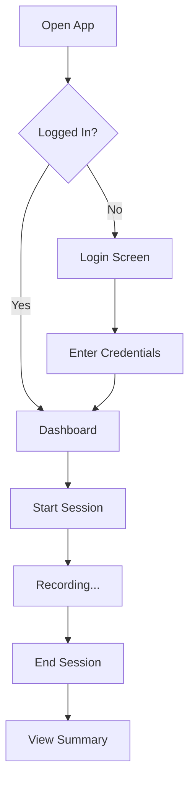

# Phase 3: Design

## Objective
Define the user experience through flows, screens, and component decisions.

## Entry Criteria
- Approved Architecture from Phase 2
- Understanding of technical constraints

## Key Activities

### 1. User Flow Mapping
Create Mermaid flowcharts for each major journey:



Key flows to map:
- Onboarding / First-time user
- Core task completion (the main "job to be done")
- Settings and preferences
- Error states and recovery

### 2. Screen Inventory
List every screen with purpose:

| Screen | Purpose | Key Elements |
|--------|---------|--------------|
| Splash | Loading/branding | Logo, progress |
| Login | Authentication | Email, password, social |
| Dashboard | Overview | Stats, recent sessions |
| Detail | Deep dive | Charts, data tables |
| Settings | Configuration | Preferences, account |

### 3. Wireframe Creation
For each screen, create ASCII or simple wireframes:

```
┌─────────────────────────────┐
│  [Logo]        [Menu ☰]    │
├─────────────────────────────┤
│                             │
│   Welcome back, {name}!     │
│                             │
│  ┌─────────┐ ┌─────────┐   │
│  │ Sessions│ │ Stats   │   │
│  │   42    │ │  1.2k   │   │
│  └─────────┘ └─────────┘   │
│                             │
│  Recent Sessions            │
│  ├─ Session 1  [→]         │
│  ├─ Session 2  [→]         │
│  └─ Session 3  [→]         │
│                             │
│  [+ Start New Session]      │
│                             │
└─────────────────────────────┘
```

### 4. Component Library Decisions
Decide on UI approach:

**Component Framework Options:**
- **Tailwind + Headless UI**: Maximum flexibility, more work
- **shadcn/ui**: Modern, copy-paste components
- **Material UI**: Comprehensive, opinionated
- **Chakra UI**: Accessible, customizable
- **Native components**: Platform-specific (iOS/Android)

**Design Tokens to Define:**
- Colors (primary, secondary, semantic)
- Typography (fonts, scale)
- Spacing (consistent gaps, margins)
- Borders and shadows

### 5. Navigation Structure
Define information architecture:

```
App
├── Dashboard (default)
├── Sessions
│   ├── List
│   ├── Detail
│   └── Compare
├── Statistics
│   ├── Overview
│   └── Trends
├── Profile
│   ├── Account
│   └── Settings
└── Onboarding (first-time only)
```

### 6. Responsive Strategy
Define breakpoints and adaptation:
- Mobile-first or desktop-first?
- Key breakpoints (sm, md, lg, xl)
- Elements that change between sizes

## Output Artifacts
- `docs/DESIGN.md` - Design Specification

## Phase Gate Checklist
Before proceeding to Planning:
- [ ] All user flows documented
- [ ] Screen inventory complete
- [ ] Wireframes for key screens
- [ ] Component library decision made
- [ ] Navigation structure defined
- [ ] Responsive strategy documented
- [ ] User has approved design spec

## Design Principles to Apply
1. **Consistency**: Same patterns throughout
2. **Feedback**: User always knows what's happening
3. **Efficiency**: Minimize steps for common tasks
4. **Forgiveness**: Easy to undo/recover from errors
5. **Accessibility**: Works for all users
